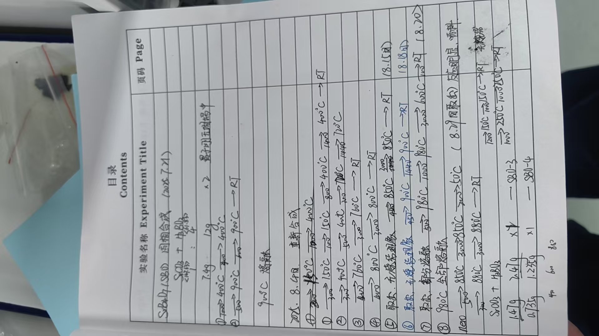

# 🧪 SrBaO₃ (SBO) 固相合成
> **📅 日期**: 2025-07-21 | **🔥 设备**: Tube Furnace | **⚗️ 方法**: Solid State

---

## ⚗️ 反应体系
**方程式**: 
> $SrCO₃ + BaCO₃ → SrBaO₃ + 2CO₂$

## ⚖️ 配料表
| 组分 | 质量 (Mass) | 摩尔比 (Ratio) | 备注 (Role) |
| :--- | :--- | :--- | :--- |
| **SrCO₃** | 7.4g | 1 | Raw Material |
| **BaCO₃** | 12g | 1 | Raw Material |

## 🌡️ 生长工艺
- **最高/源区温度**: `900°C`
- **保温时长**: `6h`
- **完整流程**: 
    > RT → 400°C (2h) → 400°C (2h) → 900°C (5h) → 900°C (6h) → RT

## 📌 备注
产物为900°C熔融态，未观察到明显晶体生长；后续实验中进行重新合成并多次升温降温处理。

---

# 🧪 SrBaO₃ (SBO) 重新合成
> **📅 日期**: 2025-08-04 | **🔥 设备**: Tube Furnace | **⚗️ 方法**: Solid State

---

## ⚗️ 反应体系
**方程式**: 
> $SrCO₃ + BaCO₃ → SrBaO₃ + 2CO₂$

## ⚖️ 配料表
| 组分 | 质量 (Mass) | 摩尔比 (Ratio) | 备注 (Role) |
| :--- | :--- | :--- | :--- |
| **SrCO₃** | 1.47g | 1 | Raw Material |
| **BaCO₃** | 2.47g | 1 | Raw Material |

## 🌡️ 生长工艺
- **最高/源区温度**: `900°C`
- **保温时长**: `14h`
- **完整流程**: 
    > RT → 150°C (3h) → 150°C (1h) → 400°C (8h) → 400°C (1h) → RT
→ 400°C (3h) → 400°C (5h) → 700°C (3h) → 720°C (1h) → RT
→ 760°C (4h) → 760°C (3h) → RT
→ 800°C (2h) → 800°C (3h) → RT
→ 850°C (5h) → 850°C (3h) → 50°C (2h) → RT
→ 880°C (3h) → 880°C (3h) → RT

## 🔬 结果表征
| 类型 | 标注 | 描述 |
| :--- | :--- | :--- |
| Photo | **取样1** | 无熔结现象 |
| Photo | **取样2** | 无熔结现象 |
| Photo | **取样3** | 部分熔融 |
| Photo | **取样4** | 全部熔融 |

## 📌 备注
多次升温至850–880°C后出现熔融现象，表明可能已接近或超过分解温度；最终在880°C保持3小时后冷却至室温。

---

# 🧪 SrBaO₃ (SBO) 合成优化
> **📅 日期**: 2025-08-29 | **🔥 设备**: Tube Furnace | **⚗️ 方法**: Solid State

---

## ⚗️ 反应体系
**方程式**: 
> $SrCO₃ + BaCO₃ → SrBaO₃ + 2CO₂$

## ⚖️ 配料表
| 组分 | 质量 (Mass) | 摩尔比 (Ratio) | 备注 (Role) |
| :--- | :--- | :--- | :--- |
| **SrCO₃** | 0.735g | 1 | Raw Material |
| **BaCO₃** | 1.235g | 1 | Raw Material |

## 🌡️ 生长工艺
- **最高/源区温度**: `250°C`
- **保温时长**: `10h`
- **完整流程**: 
    > RT → 150°C (12h) → 150°C (1h) → RT → 250°C (10h) → 250°C (1h) → RT

## 📌 备注
低温煅烧处理，用于去除碳酸盐中的CO₂；最终产物为粉末状，未见明显结晶形态。