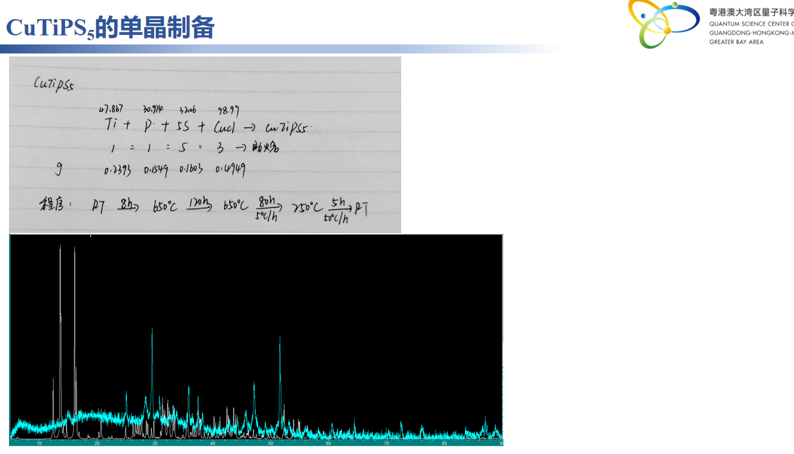

# 🧪 CuTiPS₅的单晶制备
> **📅 日期**: - | **🔥 设备**: Tube Furnace | **⚗️ 方法**: Solid State

---

## ⚗️ 反应体系
**方程式**: 
> $Ti + P + 5S + CuCl → CuTiPS₅$

## ⚖️ 配料表
| 组分 | 质量 (Mass) | 摩尔比 (Ratio) | 备注 (Role) |
| :--- | :--- | :--- | :--- |
| **Ti** | 0.2373 | 1 | Raw Material |
| **P** | 0.0549 | 1 | Raw Material |
| **S** | 0.1603 | 5 | Raw Material |
| **CuCl** | 0.14949 | 3 | Raw Material |

## 🌡️ 生长工艺
- **最高/源区温度**: `650°C`
- **保温时长**: `120h`
- **完整流程**: 
    > RT -> 650℃ (8h) -> 保持120h -> 以5℃/h降温至750℃ (80h) -> 以50℃/h降温至RT (5h)

## 🔬 结果表征
| 类型 | 标注 | 描述 |
| :--- | :--- | :--- |
| Photo | **XRD谱图** | 展示产物的X射线衍射图谱，用于相纯度和晶体结构分析。 |

## 📌 备注
无明显助熔剂或输运剂；使用化学计量比原料进行固相反应；过程包含长时间高温保温及缓慢降温，符合固相烧结特征；RT指室温起始温度。