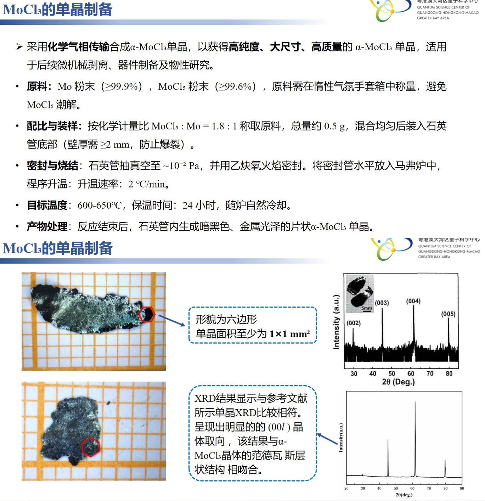

# 🧪 MoCl₃的单晶制备
> **📅 日期**: - | **🔥 设备**: Tube Furnace | **⚗️ 方法**: CVT

---

## ⚖️ 配料表
| 组分 | 质量 (Mass) | 摩尔比 (Ratio) | 备注 (Role) |
| :--- | :--- | :--- | :--- |
| **MoCl₅** | ~0.3 g | 1.8 | Raw Material |
| **Mo** | ~0.2 g | 1 | Raw Material |

## 🌡️ 生长工艺
- **最高/源区温度**: `600-650°C`
- **保温时长**: `24 h`
- **完整流程**: 
    > RT -> 600-650°C (升温速率: 2 °C/min) -> 保温 24 小时 -> 随炉自然冷却

## 🔬 结果表征
| 类型 | 标注 | 描述 |
| :--- | :--- | :--- |
| Microscope | **单晶形貌** | 形貌为六边形，单晶面积至少为 1×1 mm²，呈暗黑色、金属光泽 |
| Photo | **XRD 图谱** | XRD结果与参考文献所示单晶XRD相符，呈现明显的(007)晶体取向，符合α-MoCl₃的范德瓦尔斯层状结构 |

## 📌 备注
原料按化学计量比混合，石英管抽真空至~10⁻² Pa并用乙炔氧火焰熔封；产物为片状α-MoCl₃单晶，具有明显晶体取向。