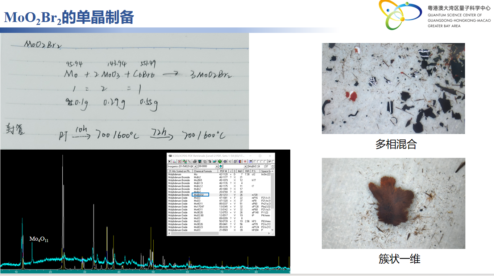

# 🧪 MoO₂Br₂的单晶制备
> **📅 日期**: None | **🔥 设备**: Tube Furnace | **⚗️ 方法**: Solid State

---

## ⚗️ 反应体系
**方程式**: 
> $Mo + 2 MoO₃ + C₆Br₆ → 3 MoO₂Br₂$

## ⚖️ 配料表
| 组分 | 质量 (Mass) | 摩尔比 (Ratio) | 备注 (Role) |
| :--- | :--- | :--- | :--- |
| **Mo** | 0.19 | 1 | Raw Material |
| **MoO₃** | 0.29 | 2 | Raw Material |
| **C₆Br₆** | 0.55 | 1 | Raw Material |

## 🌡️ 生长工艺
- **最高/源区温度**: `700°C`
- **保温时长**: `10h`
- **完整流程**: 
    > RT -> 700/600°C (10h) -> 700/600°C (72h)

## 🔬 结果表征
| 类型 | 标注 | 描述 |
| :--- | :--- | :--- |
| Photo | **多相混合** | 产物为多相混合物，包含黑色、红色等不同颜色颗粒 |
| Photo | **簇状一维** | 观察到棕色簇状一维晶体结构 |
| XRD | **XRD图谱** | XRD显示存在Mo₄O₁₁峰，表明产物中存在杂质相 |

## 📌 备注
实验采用固相反应法，原料按化学计量比混合。最终产物未完全转化为目标相MoO₂Br₂，存在Mo₄O₁₁等杂质。产物形态包括多相混合和簇状一维晶体。