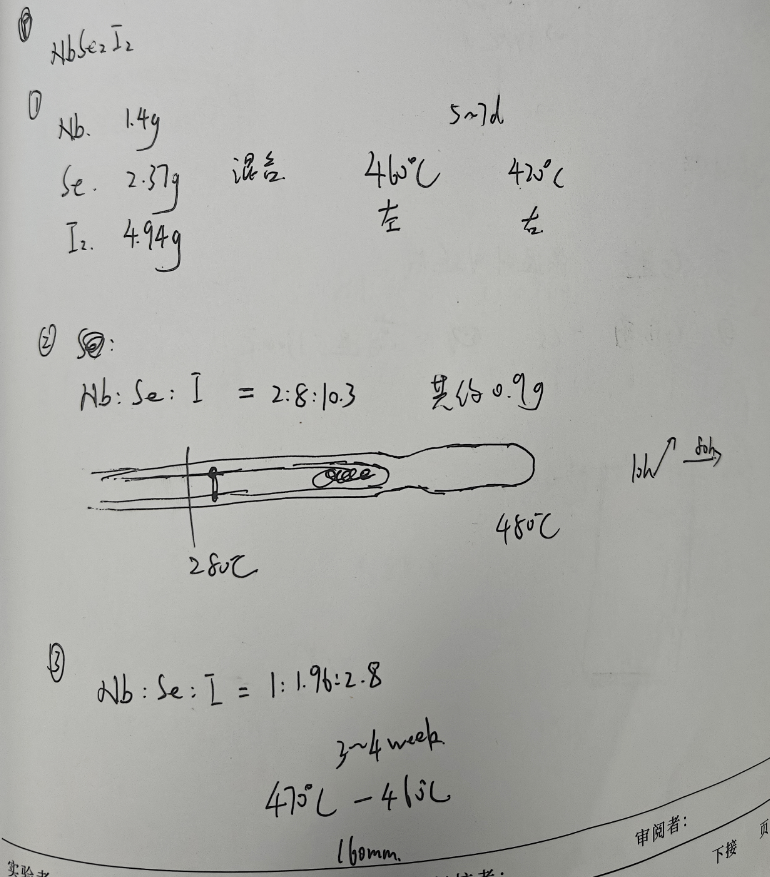

# 🧪 NbSe₂I₂晶体生长实验
> **📅 日期**: 未记录 | **🔥 设备**: Tube Furnace | **⚗️ 方法**: CVT

---

## ⚖️ 配料表
| 组分 | 质量 (Mass) | 摩尔比 (Ratio) | 备注 (Role) |
| :--- | :--- | :--- | :--- |
| **Nb** | 1.4g | 2 | Raw Material |
| **Se** | 2.37g | 8 | Raw Material |
| **I₂** | 4.94g | 10.3 | Transport Agent |

## 🌡️ 生长工艺
- **最高/源区温度**: `480°C`
- **低温区温度**: `280°C`
- **保温时长**: `10h`
- **完整流程**: 
    > RT -> 480°C (10h) -> 280°C (保持), 晶体在低温区生长，源区温度为480°C，生长区温度为280°C，石英管内双温区设计，左侧高温，右侧低温。

## 🔬 结果表征
| 类型 | 标注 | 描述 |
| :--- | :--- | :--- |
| Photo | **晶体照片** | 未提供图像，但标注产物为NbSe₂I₂单晶，长度约160mm，生长周期3~4周。 |

## 📌 备注
使用I₂作为输运剂，明确存在双温区（480°C/280°C），符合CVT特征；原料比例接近化学计量比（Nb:Se:I = 1:1.96:2.8），但I₂过量用于气相传输；生长周期较长，说明为缓慢扩散过程。