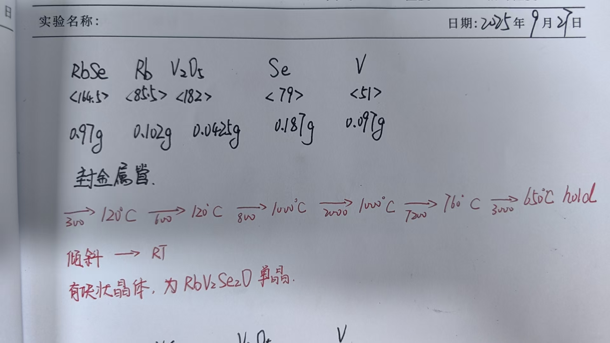

# 🧪 RbV₂Se₂O单晶生长
> **📅 日期**: 2025-09-27 | **🔥 设备**: Tube Furnace | **⚗️ 方法**: Solid State

---

## ⚗️ 反应体系
**方程式**: 
> $RbSe + V₂O₅ + Se + V → RbV₂Se₂O$

## ⚖️ 配料表
| 组分 | 质量 (Mass) | 摩尔比 (Ratio) | 备注 (Role) |
| :--- | :--- | :--- | :--- |
| **RbSe** | 0.97g | <164.5> | Raw Material |
| **Rb** | 0.102g | <85.5> | Raw Material |
| **V₂O₅** | 0.0425g | <182> | Raw Material |
| **Se** | 0.187g | <79> | Raw Material |
| **V** | 0.097g | <51> | Raw Material |

## 🌡️ 生长工艺
- **最高/源区温度**: `1200°C`
- **保温时长**: `2h`
- **完整流程**: 
    > RT -> 120°C (3h) -> 120°C (6h) -> 1000°C (8h) -> 1200°C (20h) -> 760°C (72h) -> 650°C (30h) hold, 随炉冷却至室温

## 🔬 结果表征
| 类型 | 标注 | 描述 |
| :--- | :--- | :--- |
| Photo | **晶体照片** | 有块状晶体，为RbV₂Se₂O单晶 |

## 📌 备注
封金属管；无输运剂；无助熔剂；所有原料按化学计量比混合，高温烧结后降温结晶，符合固相反应特征。