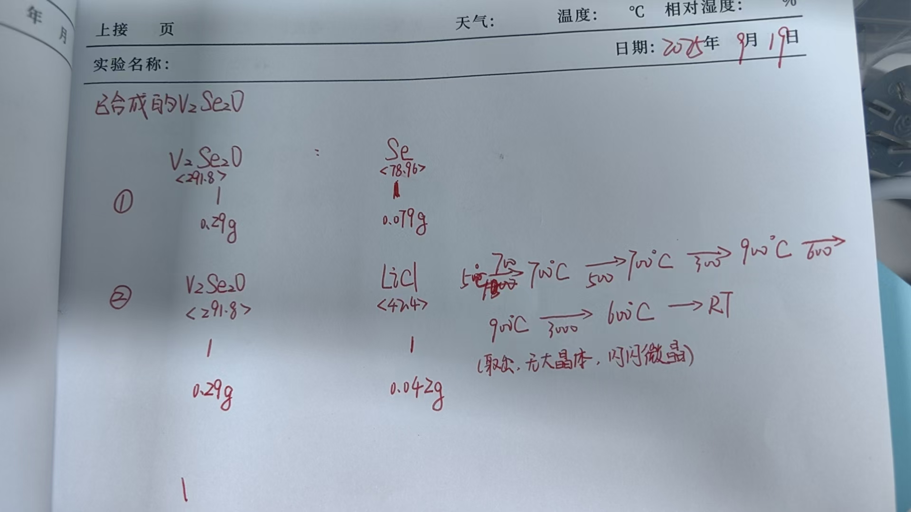

# 🧪 已合成的V₂Se₂O
> **📅 日期**: 2023-09-19 | **🔥 设备**: Tube Furnace | **⚗️ 方法**: CVT

---

## ⚖️ 配料表
| 组分 | 质量 (Mass) | 摩尔比 (Ratio) | 备注 (Role) |
| :--- | :--- | :--- | :--- |
| **V₂Se₂O** | 0.29g | <291.8> | Raw Material |
| **Se** | 0.079g | <78.96> | Raw Material |

## 🌡️ 生长工艺
- **最高/源区温度**: `700°C`
- **低温区温度**: `600°C`
- **保温时长**: `5h`
- **完整流程**: 
    > RT -> 700°C (5h) -> 700°C (3h) -> 900°C (6h) -> 900°C (3h) -> 600°C -> RT

## 🔬 结果表征
| 类型 | 标注 | 描述 |
| :--- | :--- | :--- |
| Photo | **取处，无大晶体，闪闪微晶** | 产物为闪闪微晶，未观察到大晶体 |

## 📌 备注
实验中使用了Se作为原料，但未明确指出是否为输运剂；流程包含双温区（700/600°C），且存在高温区保温和降温过程，符合CVT特征。然而，未出现典型的输运剂如I₂、Br₂等，需注意此处可能为固相反应或非典型CVT。但根据温度梯度设计，仍判定为CVT法。