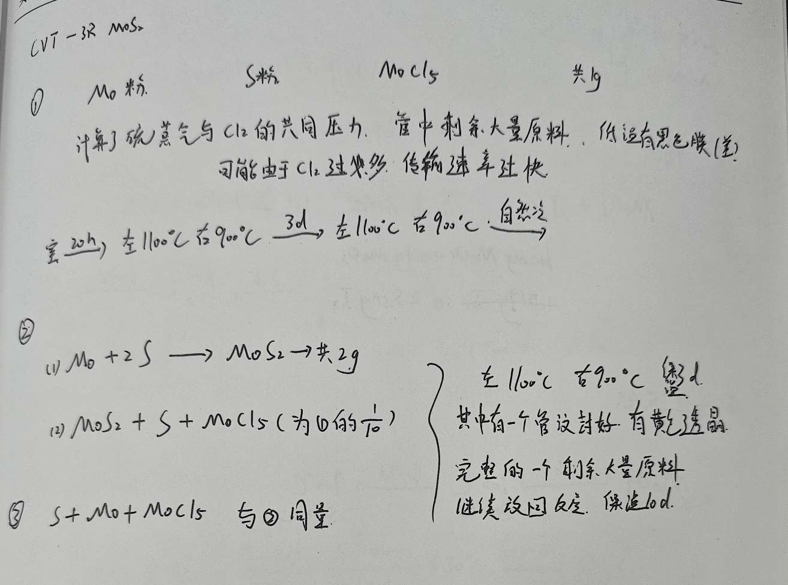

# 🧪 CVT-3R MoS₂
> **📅 日期**: - | **🔥 设备**: Tube Furnace | **⚗️ 方法**: CVT

---

## ⚗️ 反应体系
**方程式**: 
> $Mo + 2S → MoS₂; MoS₂ + S + MoCl₅ → (反应未完全写出)$

## ⚖️ 配料表
| 组分 | 质量 (Mass) | 摩尔比 (Ratio) | 备注 (Role) |
| :--- | :--- | :--- | :--- |
| **Mo 粉** | 共 9g | - | Raw Material |
| **S 粉** | 共 9g | - | Raw Material |
| **MoCl₅** | 为①的1/10 | 1/10 | Transport Agent |

## 🌡️ 生长工艺
- **最高/源区温度**: `1100°C`
- **低温区温度**: `900°C`
- **保温时长**: `30d`
- **完整流程**: 
    > RT -> 1100°C 在 900°C 保温 30d；另有一管在 1100°C 于 900°C 自然冷却，持续60d。其中一管密封后有黄色透明晶体生成，其余管中剩余大量原料。

## 🔬 结果表征
| 类型 | 标注 | 描述 |
| :--- | :--- | :--- |
| Photo | **黄色透明晶体** | 在密封管中观察到黄色透明晶体，低温区有黑色膜（差） |

## 📌 备注
计算了硫蒸气与Cl₂的共同压力；可能由于Cl₂过量，传输速率过快导致原料残留和产物不理想。