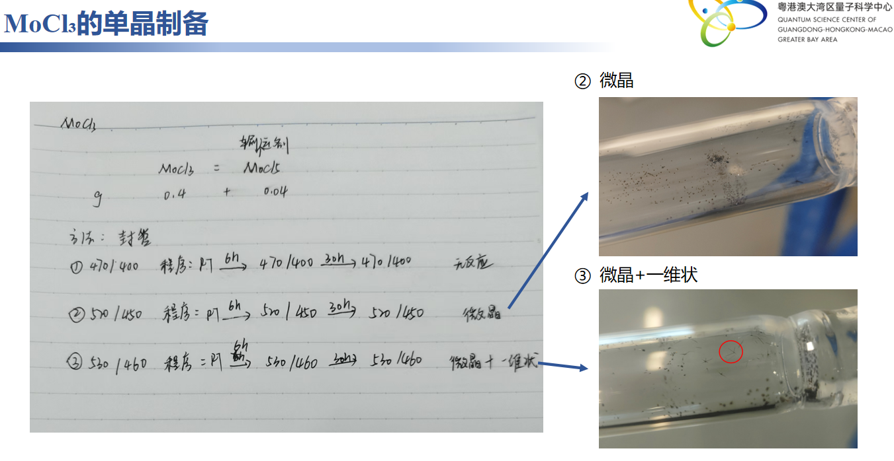

# 🧪 MoCl₃的单晶制备
> **📅 日期**: - | **🔥 设备**: Tube Furnace | **⚗️ 方法**: CVT

---

## ⚗️ 反应体系
**方程式**: 
> $MoCl₅ + I₂ → MoCl₃ + I₂ (气相传输，无明确化学方程式)$

## ⚖️ 配料表
| 组分 | 质量 (Mass) | 摩尔比 (Ratio) | 备注 (Role) |
| :--- | :--- | :--- | :--- |
| **MoCl₅** | 0.4 | 1 | Raw Material |
| **I₂** | 0.04 | 0.1 | Transport Agent |

## 🌡️ 生长工艺
- **最高/源区温度**: `520°C`
- **低温区温度**: `460°C`
- **保温时长**: `6h`
- **完整流程**: 
    > RT → 520/460°C (6h) → 520/460°C (30h) → 520/460°C (保温)，采用双温区密封管法进行气相传输生长。

## 🔬 结果表征
| 类型 | 标注 | 描述 |
| :--- | :--- | :--- |
| Photo | **微晶** | 石英管内壁附着少量黑色微小晶体颗粒。 |
| Photo | **微晶+一维状** | 在低温区观察到微晶及少量一维线状晶体（红圈标记处）。 |

## 📌 备注
实验使用碘(I₂)作为输运剂，存在明确的双温区设置(520/460°C)，符合CVT特征；产物为微晶与一维结构，未见液相分离操作，排除Flux法；封管处理，说明为气相反应。